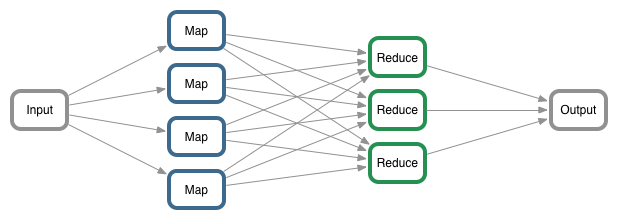
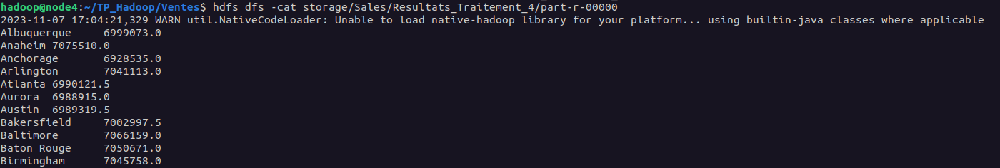

# MapReduce Explanation

MapReduce is a widely used programming model and data processing paradigm for large-scale data processing, particularly in the context of distributed computing. It was popularized by Google and forms the foundation of the Hadoop framework, which is commonly employed for big data processing.



## Map Phase:
- In this phase, input data is divided into smaller chunks called "splits."
- A set of mapping functions (the "map" function) is applied to each split. The map function takes this data as input, processes it, and produces a set of intermediate key-value pairs.
- Each intermediate key-value pair is associated with a key that identifies a group of related data.

## Reduce Phase:
- In this phase, the data is sorted based on the key, grouping together key-value pairs that share the same key.
- A set of reducing functions (the "reduce" function) is applied to each group of key-value pairs with the same key.
- The reduce function takes these data groups as input, processes them, and produces a set of output key-value pairs, typically fewer in number than the intermediate pairs.
- The final results of the reduction are stored in an output file.

The MapReduce model offers several advantages, including ease of parallelization, fault tolerance, and seamless handling of data distribution across a cluster of machines. It also allows for efficient processing of massive data volumes by breaking the task into smaller subtasks that can be executed in parallel.

# TP: MapReduce, YARNet API Java

## How the Mapper Works

In this MapReduce job, we have a Mapper class called "VenteMapper" that processes the input data. Let's break down how the Mapper works:

```java
import java.io.IOException;
import org.apache.hadoop.io.FloatWritable;
import org.apache.hadoop.io.IntWritable;
import org.apache.hadoop.io.LongWritable;
import org.apache.hadoop.io.Text;
import org.apache.hadoop.mapreduce.Mapper;

public class VenteMapper extends Mapper<LongWritable, Text, Text, FloatWritable>
{
    private static FloatWritable one;
    private Text City = new Text();

    public void map(LongWritable Key, Text value, Mapper.Context context)
            throws IOException, InterruptedException{
        String InputLine = value.toString();
        String[] Splited_InputLine = InputLine.split("\t");
        City.set(Splited_InputLine[2]);
        String s = Splited_InputLine[4];
        float ss = Float.parseFloat(s);
        one = new FloatWritable(ss);
        context.write(City, one);
    }
}
```
This Mapper is responsible for processing input data. Here's a step-by-step explanation of how it works:

1. The Mapper class extends the Hadoop Mapper class and is configured to take LongWritable (key), Text (value) as input, and produce Text (key) and FloatWritable (value) as output.

2. Inside the map method, the input key, value, and context are provided as parameters. The key is of type LongWritable, the value is a line of text, and the context is used to emit key-value pairs as output.

3. The input line is converted to a String using value.toString(). This line is then split into fields using tab ("\t") as the delimiter, and the third column is extracted and stored in the "City" variable.

4. The fifth column (assumed to be a floating-point number) is extracted as a String, converted to a float, and stored in the "one" variable.

5. Finally, the Mapper emits a key-value pair using context.write(City, one), where "City" is the key (representing the city) and "one" is the value (a floating-point number).

## How the Reducer Works

In this MapReduce job, we also have a Reducer class called "VenteReducer" responsible for processing the intermediate key-value pairs produced by the Mapper and producing the final output. Let's take a closer look at how the Reducer works:

```java
import org.apache.hadoop.io.FloatWritable;
import org.apache.hadoop.io.Text;
import org.apache.hadoop.mapreduce.Reducer;
import java.io.IOException;

public class VenteReducer extends Reducer<Text, FloatWritable, Text, FloatWritable>
{
    private FloatWritable result = new FloatWritable();

    public void reduce(Text key, Iterable<FloatWritable> values, Context context)
            throws IOException, InterruptedException {
        float Sum = 0;
        for (FloatWritable val : values) {
            Sum = Sum + val.get();
        }
        result.set(Sum);
        context.write(key, result);
    }
}
```
Here's a step-by-step explanation of how the Reducer works:

1. The Reducer class extends the Hadoop Reducer class and is configured to take Text (key), FloatWritable (value) as input, and produce Text (key) and FloatWritable (value) as output.

2. Inside the reduce method, the input key, values, and context are provided as parameters. The key is of type Text, values are an iterable collection of FloatWritable objects, and the context is used to emit key-value pairs as output.

3. The Reducer initializes a variable Sum to zero, which will be used to accumulate the sum of all values for the same key.

4. A loop iterates through the values collection, and for each FloatWritable value, it extracts the float value using val.get() and adds it to the Sum.

5. After processing all values, the result is set to the accumulated sum using result.set(Sum).

6. Finally, the Reducer emits a key-value pair using context.write(key, result), where "key" is the key received from the Mapper, and "result" is the final sum for that key.

The Reducer is responsible for aggregating data based on the keys produced by the Mapper. It combines and summarizes the values associated with the same key, producing the final output for your MapReduce job.

## Our results: 

We have computed the total sales amount per city by employing the MapReduce architectural pattern.


## Contributors

- DUVAL Aurélie
- DEPIT Chloé
- ROYER--BOURNELLE Antoine